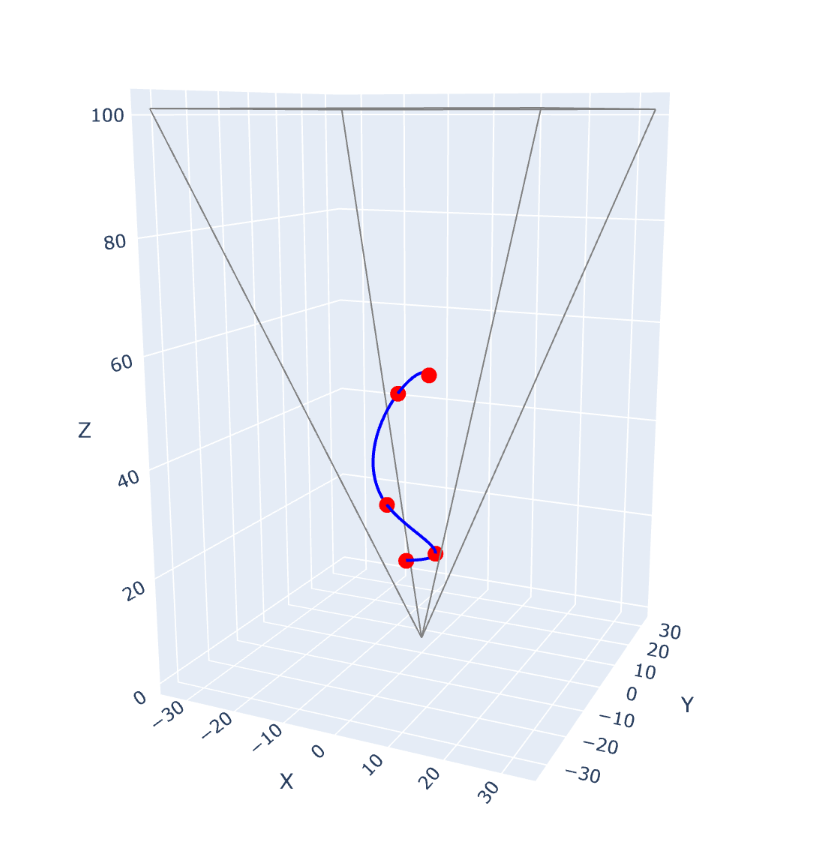
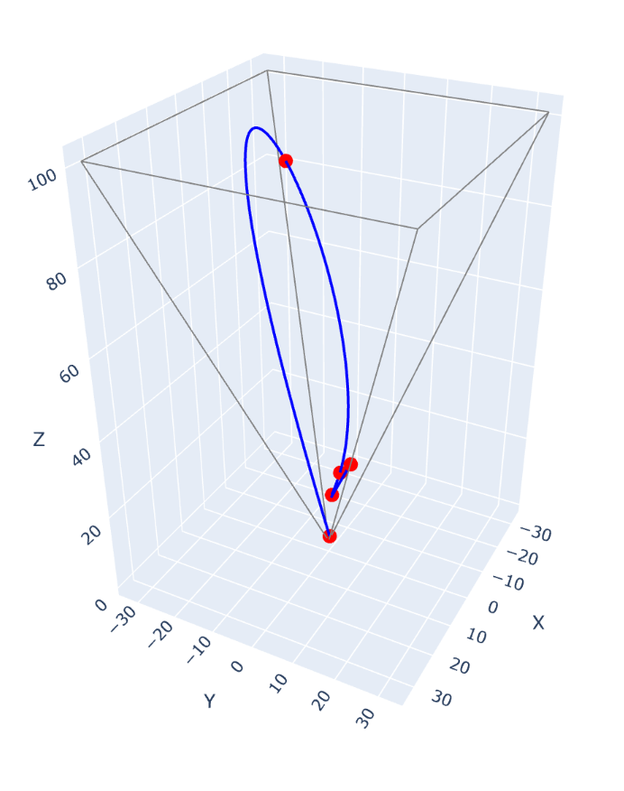
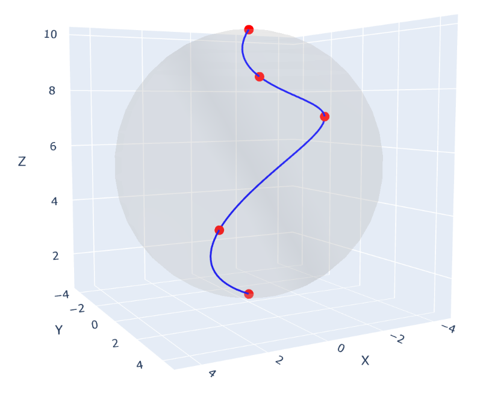
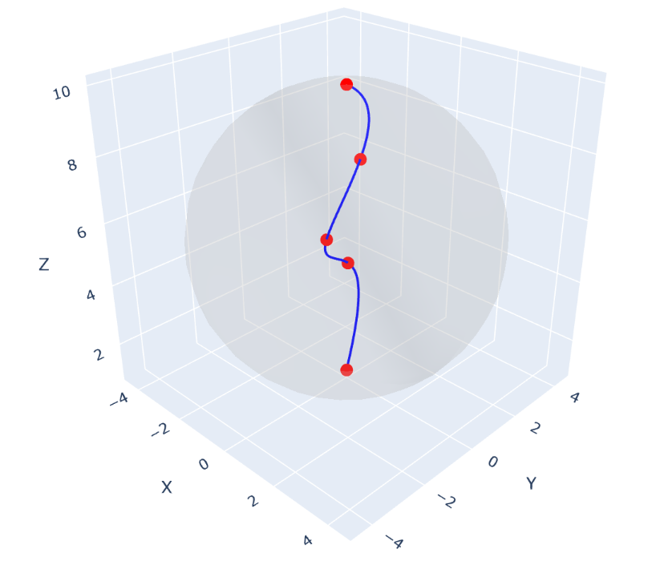

# CV_utils
Computer Vision Utilities of Marius.

## Examples

### Generating trajectories

Either in viewport:

Or in world space inside a sphere:

### Generating videos

Rendering images along trajectory and blending with background.
